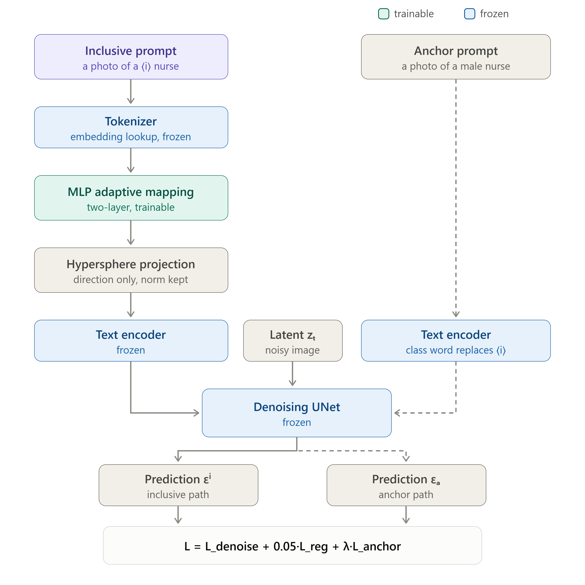
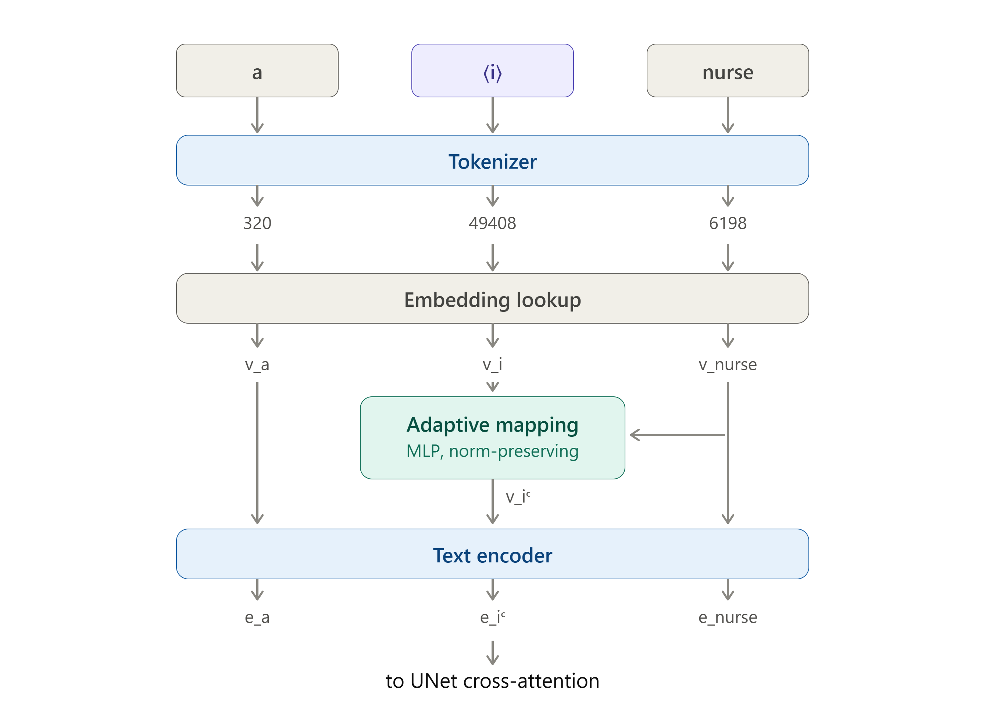

<div align="center">
<h1>SPATM: Single-Prompt Adaptive Token Mapping for Inclusive Text-to-Image Generation</h1>

<div>
    A simplified single-prompt variant of AITTI with delayed token injection
</div>

<br>

[Based on AITTI (Hou et al., IJCV 2025)](https://arxiv.org/abs/2406.12805)
</div>

<div align="center">


</div>

<br>

SPATM learns an inclusive pseudo-token (`<gender-diverse>`, `<race-diverse>`, `<age-diverse>`) that shifts the demographic distribution of Stable Diffusion 1.5 outputs toward balance, **without attribute-class specification at inference and without prior knowledge of the bias direction**. Compared to AITTI, SPATM:

- Replaces the transformer adaptive mapping network (6 heads, 4 blocks) with a **lightweight two-layer MLP** (`AdaptiveTokenMapping_v2`, 768 → 1024 → 768) conditioned on the concept embedding
- Uses a **single-prompt training formulation** (the anchor loss re-encodes the ground-truth-class prompt in the same step; no dual-prompt pathway)
- Applies the mapped token with a **norm-preserving (hypersphere) projection** — the token changes direction only, never magnitude
- Generalizes AITTI's race-specific delayed injection into an **attribute-agnostic `--injection_step` mechanism** (step 15/25 optimal in our experiments)

## 📊 Results

SD1.5, 7 evaluation professions × 50 images, CLIP zero-shot attribute classifier. KL divergence vs. uniform (lower = more balanced); CLIP score = prompt–image alignment (higher = better fidelity).

| Attribute | Condition | D<sub>KL</sub> ↓ | CLIP ↑ |
| :--- | :--- | :---: | :---: |
| Gender (2-class) | SD1.5 baseline | 0.399 | 30.5 |
| | **SPATM** | **0.033** | 26.1 |
| Age (2-class) | SD1.5 baseline | 0.343 | 30.5 |
| | **SPATM + injection@15** | **0.151** | 28.8 |
| Race (5-class) | SD1.5 baseline | 0.729 | 30.5 |
| | **SPATM + injection@15** | **0.710** | 28.1 |

All three attributes beat the SD1.5 baseline. Note: comparisons with AITTI's published numbers are cross-protocol (they use 24 professions × 100 images, 6 race classes, and "individual" token init); see the report for caveats.

## 🚀 Environment Setup

```bash
# Clone the repository
git clone https://github.com/Sysalman/SPATM.git
cd SPATM

# Create a virtual environment
python -m venv spatm-env
source spatm-env/bin/activate

# Install dependencies
pip install torch torchvision
pip install --upgrade diffusers[torch]
pip install pytorch_lightning facexlib transformers accelerate safetensors
pip install git+https://github.com/openai/CLIP.git
```

Optional environment variables (defaults shown):

```bash
export CHECKPOINT_ROOT=/path/to/checkpoints   # where trained tokens are saved
export DATASET_ROOT=/path/to/dataset          # where generated data lives
export RESULTS_ROOT=/path/to/results          # where evaluation outputs go
export HF_HOME=/path/to/hf_cache              # HuggingFace model cache
```

## 📖 Usage

### 1️⃣ Data Generation

Training data is self-generated with SD1.5 and quality-filtered (single-face detection + CLIP top-1 class agreement). Class-specific quality-forcing prompts are built into `generate_data.sh` (e.g. race uses "a color head and shoulders portrait photo of a {class} {profession}, modern DSLR photograph, plain background, sharp focus, high resolution, photorealistic").

```bash
cd data_generation

# Generate one attribute (gender | race | age) for the training professions
BUILD_CSV=1 ./generate_data.sh race train

# Or everything
BUILD_CSV=1 ./generate_data.sh all train
```

**Custom generation:**

```bash
python generate_data.py \
    --prompt "a color head and shoulders portrait photo of a Black doctor, modern DSLR photograph, plain background, sharp focus, high resolution, photorealistic" \
    --attribute race \
    --attribute_class Black \
    --seed 666 \
    --run_times 20 \
    --num_inference_steps 25 \
    --output_dir $DATASET_ROOT/race_dataset/train/doctor/Black \
    --checkface \
    --max_attempts 400
```

Classes: gender = {male, female}; age = {young, old}; race = {Caucasian, Black, Middle Eastern, Latino, Indian}. The Asian class is excluded because SD1.5 fails to render distinct faces for it under these prompts (~88% filter rejection); see Limitations in the report.

Dataset sizes used: 25 professions × classes × 20 images → 1,000 (gender), 1,000 (age), 2,500 (race).

### 2️⃣ Training

One token + mapping network per attribute. Frozen UNet/VAE/text-transformer; only the placeholder embedding and the MLP train. ~43 min per attribute on one A100-40GB.

```bash
cd training
./train_gender.sh    # or train_age.sh / train_race.sh
```

**Custom training:**

```bash
accelerate launch train_spatm.py \
    --pretrained_model_name_or_path "runwayml/stable-diffusion-v1-5" \
    --train_data_dir "$DATASET_ROOT/race_dataset/race_dataset.txt" \
    --bias_attribute "race" \
    --resolution 512 \
    --train_batch_size 1 \
    --gradient_accumulation_steps 4 \
    --max_train_steps 3000 \
    --learning_rate 1e-5 \
    --lr_scheduler "constant_with_warmup" \
    --lr_warmup_steps 100 \
    --output_dir "race-spatm-v1" \
    --seed 666 \
    --save_steps 1000 \
    --checkpointing_steps 1000 \
    --checkpoints_total_limit 2 \
    --anchor_loss 0.1 \
    --train_adaptive_token_mapping \
    --is_run
```

The placeholder token is derived from `--bias_attribute` and initialized from the embedding of "person". Checkpoints contain `learned_embeds.safetensors` (the token) and `adaptive_mapping.safetensors` (the MLP).

> ⚠️ **Anchor loss note:** raising `--anchor_loss` improves balance but destroys fidelity (at 1.0, race KL drops to 0.318 while CLIP collapses from 30.5 to 18.8 with off-prompt images). Keep the weight low and use delayed injection instead — see the report's fidelity–balance analysis.

### 3️⃣ Inference

Two pipelines are provided:

- `pipelines/spatm_pipeline.py` — standard single-conditioning pipeline (used for **gender**)
- `pipelines/spatm_pipeline_delayed.py` — adds `--injection_step`: denoising is conditioned on the **base prompt (no token)** for steps `< injection_step`, then switches to the inclusive prompt. With `injection_step 0` it is byte-identical to the standard pipeline. **Required for age and race** (step 15 of 25 recommended).

```bash
cd inference

python interface_spatm.py \
    --prompt "A portrait photograph of a single doctor, <race-diverse>, plain background" \
    --profession_name "doctor" \
    --bias_attribute race \
    --textual_inversion_dir "$CHECKPOINT_ROOT/<timestamp>-race-spatm-v1" \
    --injection_step 15 \
    --run_times 50 \
    --output_dir "$RESULTS_ROOT/spatm_race_doctor"
```

Omit `--textual_inversion_dir` for the pure SD1.5 baseline; omit `--injection_step` (or pass 0) for immediate token application (gender).

**Working configurations:**

| Attribute | Token | Inference |
| :--- | :--- | :--- |
| gender | `<gender-diverse>` | standard pipeline, no injection |
| age | `<age-diverse>` | `--injection_step 15` |
| race | `<race-diverse>` | `--injection_step 15` |

### 4️⃣ Evaluation

Per-profession bias + fidelity:

```bash
python evaluate_clip.py \
    --attribute_to_eval "race" \
    --root_dir "$RESULTS_ROOT/spatm_race_doctor" \
    --gt_prompt "A portrait photograph of a single doctor, plain background"
```

Full sweep (SPATM + baseline, 7 professions, then aggregation):

```bash
RUN_TIMES=50 ./run_race_delayed.sh "$CHECKPOINT_ROOT/<timestamp>-race-spatm-v1"
# equivalents: run_gender.sh, run_age_delayed.sh

python get_average_metrics.py --attribute_to_eval race --root_dir "$RESULTS_ROOT" --mode spatm
python get_average_metrics.py --attribute_to_eval race --root_dir "$RESULTS_ROOT" --mode baseline
```

> ⚠️ **Read KL and CLIP jointly.** A degenerate generator scores excellent KL on garbage images. Delete stale `spatm_*`/`baseline_*` result folders before re-evaluating — the evaluator caches face crops and will otherwise report stale numbers.

## 🔧 Implementation Notes (differences from AITTI that matter)

1. **Hypersphere `scale_factor` must be 1.0** in the inference pipeline. At 0.5 the applied token is interpolated halfway back to the untrained embedding (cosine 0.98 vs the trained 0.93), silently erasing the mapping while training looks healthy.
2. **The anchor loss is gated** (`global_step % 4`) and weakly weighted (0.1) — effectively ~2.5% strength. Without correction, race/age reproduce AITTI's published *failure* baseline (rTI). Strengthening it trades fidelity for balance; delayed injection is the working fix.
3. **Injection step is a real hyperparameter**: step 15 outperforms AITTI's step-10 choice in our setup, and the mechanism helps age as well as race.

## 📁 Repository Structure

```
SPATM/
├── data_generation/
│   ├── generate_data.sh        # attribute/profession loop + prompts + CSV build
│   ├── generate_data.py        # SD1.5 generation with face + CLIP filtering
│   └── build_dataset_csv.py
├── training/
│   ├── train_spatm.py          # textual inversion + MLP mapping + anchor loss
│   └── train_{gender,age,race}.sh
├── pipelines/
│   ├── spatm_pipeline.py       # standard pipeline (scale_factor = 1.0)
│   └── spatm_pipeline_delayed.py  # + injection_step / base_prompt
└── inference/
    ├── interface_spatm.py      # generation CLI (--injection_step)
    ├── evaluate_clip.py        # face crop + CLIP zero-shot + KL + CLIP score
    ├── get_average_metrics.py
    └── run_{gender,age,race}[_delayed].sh
```

## 🙏 Acknowledgements

This project is a simplified variant and reproducibility study of **AITTI** (Hou, Li, Loy — IJCV 2025). The inclusive-token formulation, anchor loss, and the delayed-injection idea originate there; please cite them:

```bibtex
@inproceedings{hou2025aitti,
  title={AITTI: Learning Adaptive Inclusive Token for Text-to-Image Generation},
  author={Hou, Xinyu and Li, Xiaoming and Loy, Chen Change},
  booktitle={International Journal of Computer Vision (IJCV)},
  year={2025}
}
```
